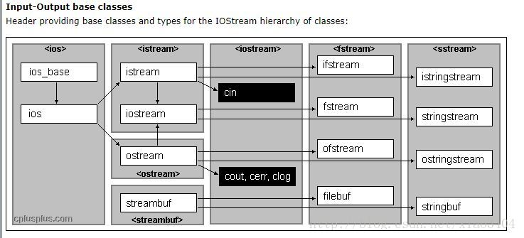

<!-- TOC -->

- [IO类](#io类)
    - [IO类的基本内容](#io类的基本内容)
        - [关于流的条件状态](#关于流的条件状态)
        - [关于缓冲区](#关于缓冲区)
    - [编写自己的输入输出运算法（14章）](#编写自己的输入输出运算法14章)
    - [控制输出格式以及文件的随机访问（17章）](#控制输出格式以及文件的随机访问17章)

<!-- /TOC -->

# IO类

## IO类的基本内容



* 从上图可以看出，iostream是读写流[^1]，fstream读写文件；从上图可以看出，fstream继承于iostream，因此发fstream也是读写流，只不过它的职责更窄，主要针对文件读写；
* cin是从流读取数据，cout是向流写入数据，由于c++中继承机制的实现，使我们不用考虑设备类型和字符大小的问题；

### 关于流的条件状态

 &emsp; &emsp; 一个流一旦发生错误，那么其后续的IO操作都会失败，只有一个流处于无错误状态时，我们才可以对其进行读写操作，因此代码应该在使用一个流之前检查它是否处于良好状态，代码如下：

```C++
while(cin >> word)

    //ok: 读操作成功,否则 >>返回false

```
&emsp; &emsp; 上面只是告诉了我们流是否有效，例如一个流失败了，我们不知道为什么失败，关于这一部分，我们可以使用iostate[^2], 也可以使用stream.eof()等函数判断；

[^1]: 流是c++中的抽象概念，我们可以认为流就是对象，如果从标准输出输入流中读写数据那么也就意味着从cout、cin中读写数据；
[^2]:iostate是一个机器无关类，提供了表达流状态的完整功能；

### 关于缓冲区

* 每个输出流都有一个缓冲区，用来保存程序读写的数据，如果我们执行文本打印操作，那么文本可能立即打印，也可能不立即打印，此时文本就被保存到了缓冲区；
* 文本缓冲区之所以存在，是因为设备的读写操作可能都很耗时，允许操作系统将多个输出操作合二为一可以带来性能提升；
* 如果我们不想使用缓冲，那么就必须进行缓冲刷新，以下方式可以导致刷新：

> 1. 程序正常结束；
> 2. 缓冲区满时；
> 3. 使用操作符endl；
> 4. 使用flush；

Warning：如果程序崩溃，那么输出缓冲区是不会被刷新的，可能存在这样一种情况：我们通过输出调试信息调试程序，但程序正好崩溃，但实际输出可能已经执行，之所以没有打印只是因为没有缓冲区没有被刷新而已；

## 编写自己的输入输出运算法（14章）

## 控制输出格式以及文件的随机访问（17章）

参考链接：<a href = "https://www.cnblogs.com/tianzeng/p/9038810.html">C++的流</a>
